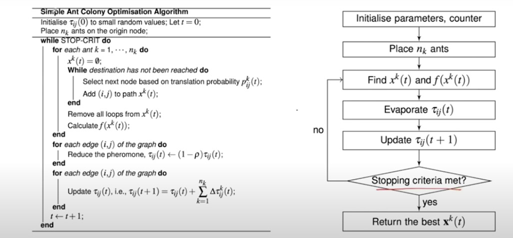

# Ant Colony Optimization (ACO) for Traveling Salesman Problem (TSP)

## Overview
This project implements the Ant Colony Optimization (ACO) algorithm to solve the Traveling Salesman Problem (TSP). The algorithm simulates the behavior of ants in finding the shortest path between multiple cities using pheromone trails and probabilistic decision-making.

## Algorithm



In the Ant Colony Optimization algorithm, probabilities are calculated using the following equation:

$$ P_{ij} = \frac{T_{ij}}{\sum_{j=0}^{n} T_{ij}} $$

Where:
- \( i \) represents the last node visited.
- \( j \) represents the nodes that have not been visited yet.
- \($T_{ij}$\) is the pheromone level on the edge between nodes \( i \) and \( j \).
- The denominator \( $\sum_{j=0}^{n} T_{ij}$ \) is the sum of pheromone levels for all unvisited nodes \( j \) from node \( i \).

After calculating the probabilities, the cumulative probability is computed to bin the values for decision-making.

## Installation
### Prerequisites
- Python 3.x
- NumPy

### Setup
1. Clone the repository:
   ```bash
   git clone https://github.com/joelsathi/Ant-Colony-Optimisation-Python-Implementation.git
   cd Ant-Colony-Optimisation-Python-Implementation
   ```
2. Install dependencies:
   ```bash
   pip install -r requirements.txt
   ```
3. Ensure the input file `input.txt` is formatted correctly (see below).

## Usage
Run the script with:
```bash
python main.py
```

## Input Format
The input file (`input.txt`) should be structured as follows:
```
<number_of_towns>
<distance_matrix_rows>
<number_of_ants>
<initial_guess_paths>
```
Example:
```
4
0 10 15 20
10 0 35 25
15 35 0 30
20 25 30 0
3
1 2 3 4
2 3 4 1
3 4 1 2
```

## Output
The program writes the results, including the pheromone matrix and best path found, to `output.txt`.

## File Structure
```
├── main.py  # Main execution script
├── utils.py  # Utility functions
├── pheromone_calculator.py  # Pheromone matrix update logic
├── probability_calculator.py  # Path selection logic
├── distance_calculator.py  # Distance computation functions
├── input_reader.py  # Input file handling
├── input.txt  # Sample input file
├── output.txt  # Generated output file
```

## License
This project is licensed under the MIT License.

## Acknowledgments
This project is inspired by the natural behavior of ants in path optimization. Special thanks to Mr. Hasitha Premasiri for his insightful lecture on Ant Colony Optimization, which provided the foundation for this implementation.

